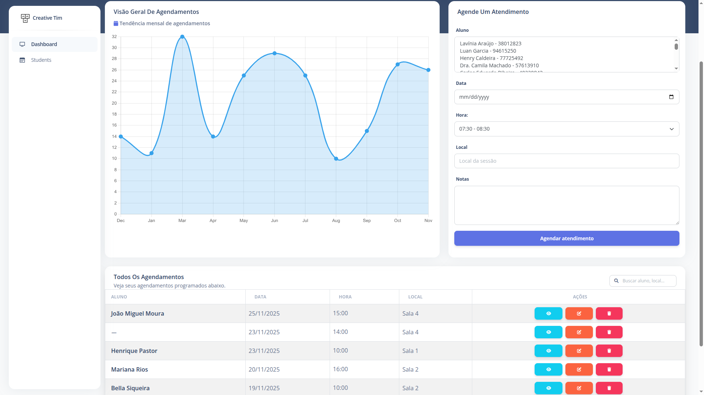

# Agendix

Agendix é um sistema de gestão para Atendimento Educacional Especializado (AEE), desenvolvido para facilitar o acompanhamento de alunos e agendamento de sessões.

## 📋 Sobre o Projeto

O sistema visa auxiliar profissionais da educação na administração de atividades de AEE, fornecendo ferramentas para o cadastro de alunos e professores e controle de frequência em sessões.



## ✨ Funcionalidades Principais

- **Gestão de Usuários**:
  - Cadastro de Alunos com informações de matrícula e curso.
- **Agendamento e Sessões**:
  - Registro de sessões de atendimento (data, hora, local, observações).
  - Controle de presença (frequência) dos alunos.
- **Dashboard**: Visualização de dados e métricas de atendimentos.

## 🚀 Tecnologias Utilizadas

- **Python**
- **Django** 
- **SQLite** 
- **HTML5 / CSS3** 
- **Faker** 

## 📦 Como Executar o Projeto

### Pré-requisitos

Certifique-se de ter o **Python** instalado em sua máquina. O gerenciamento de dependências pode ser feito via `pip` ou `uv`.

### Instalação

1.  **Clone o repositório**:

    ```bash
    git clone https://github.com/Maikoandre/Agendix.git
    cd Agendix
    ```

2.  **Configure o ambiente virtual**:

    - Usando `venv` padrão:
      ```bash
      python -m venv .venv
      source .venv/bin/activate  # Linux/macOS
      # .venv\Scripts\activate   # Windows
      ```

3.  **Instale as dependências**:

    ```bash
    pip install django faker
    ```

4.  **Configure o Banco de Dados**:
    Execute as migrações para criar as tabelas necessárias:

    ```bash
    python manage.py migrate
    ```

5.  **Popule com Dados de Teste (Opcional)**:

    > **Aviso**: O script `data_seed.py` limpa o banco de dados antes de inserir novos dados. Use com cuidado em ambientes de produção.

    ```bash
    python data_seed.py
    ```

6.  **Inicie o Servidor**:

    ```bash
    python manage.py runserver
    ```

7.  **Acesse o Sistema**:
    Abra o navegador e vá para: `http://127.0.0.1:8000`

## 📂 Estrutura do Projeto

- `aee/`: Configurações principais do projeto Django (settings, urls).
- `schedule/`: Aplicação principal (Models, Views, Forms).
  - `models.py`: Definição das entidades (User, Student, Session, etc.).
- `templates/`: Arquivos HTML do frontend.
- `static/`: Arquivos estáticos (CSS, JS, imagens).
- `data_seed.py`: Script para popular o banco de dados.

## 🤝 Contribuição

Contribuições são bem-vindas! Sinta-se à vontade para abrir issues ou enviar pull requests.

---

Desenvolvido por Maiko.
